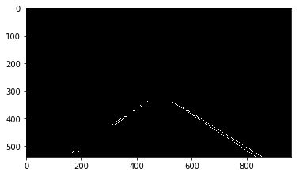

# **Finding Lane Lines on the Road** 

## Writeup Template

### You can use this file as a template for your writeup if you want to submit it as a markdown file. But feel free to use some other method and submit a pdf if you prefer.

---

**Finding Lane Lines on the Road**

The goals / steps of this project are the following:
* Make a pipeline that finds lane lines on the road
* Reflect on your work in a written report

[//]: # (Image References)

[image1]: ./examples/grayscale.jpg "Grayscale"
[gray_test]: ./gray_test.png "Grayscale"
[blured_test]: ./blured_test.png "GaussianBluredImage"
[canny_test]: ./canny_test.png "CannyEdge"
[roi_test]: ./roi_test.png "ROI"
[hough_test]: ./hough_test.png "HoughLines"
[final_test]: ./final_test.png "FinalImageWithHoughLines"
[yellow_white_test]: ./yellow_white_test.png "YellowWhiteFiltered"
---

### Reflection

### 1. Describe your pipeline. As part of the description, explain how you modified the draw_lines() function.

My pipeline consisted of 6 steps:

#### 1. Get Grayscale image

#### 2. Gaussian blur the gray image

#### 3. Process the blured image to get canny edge

#### 4. Apply a trapezoid polygon to mask the canny edge image

#### 5. Get Hough lines in Hough space for the mask image

#### 5. Draw lane lines on the original image

In order to also detect yellow lines, I filtered the image to get only the yellow and white pixels in the image and left all the other pixels to be black. This way, the later steps such as Canny edge detection will be more efficient.

In order to draw a single line on the left and right lanes, I modified the draw_lines() function by introducing the following 4 steps:
##### 1. Do a linear regression on both left and right lines to get the slopes and intersections for both lines to draw.
###### 1. I separate the points according to their slopes. Because the upper left corner is the origin point (0, 0), which means the left line will have negative slope while the right line will have positive slope.
###### 2. Moreover, the right lines will only be recorded if the slope is above certain threshold, which is 0.4 and is picked by hand in this experimental setup to provide the best performance. Similarly, the left lines will be recored when the slope is bellow the same but negated threshold.
###### 3. A minimum y value will be maintained for the final drawing of the two lines. The draw_lines function will take another max_height parameter, which is the height of the image minus the height of the trapezoid region of interest. This minimum y value together with the max y value(the height of the image) will be the y values of the four points of the trapezoid region.
##### 2. Draw the previous lines from last calculation if either of the two lines are empty or any of the slopes are zeros.
##### 3. Use equation x = (y-b)/m to get x values for the four points of the trapezoid shape. If the top x value of the left line is bigger than that of the right line, I need to adjust the x values by shifting the them away from each other.
##### 4. Smooth the current lines and the previous lines. I did this by adding more weight to previous lines' parameters and less weight to current lines' parameters. The weights are 0.8 and 0.2 for previous lines and current lines respectively.

### 2. Identify potential shortcomings with your current pipeline

One potential shortcoming would be what would happen when the slope of the lane lines is smaller than the hand picked 0.4. This can happen if the camera parameters are different or the roads are very steep.

Another shortcoming could be that I can only detect straight lines with this simple implementation. What if the roads are going up hill?

### 3. Suggest possible improvements to your pipeline

A possible improvement would be to do a practical analysis across large image data set that is collected by the same camera set up to get the average slope threshold. To deal with curve lines, we need transformations like perspective transformation and also polyfit to get more parameters.
